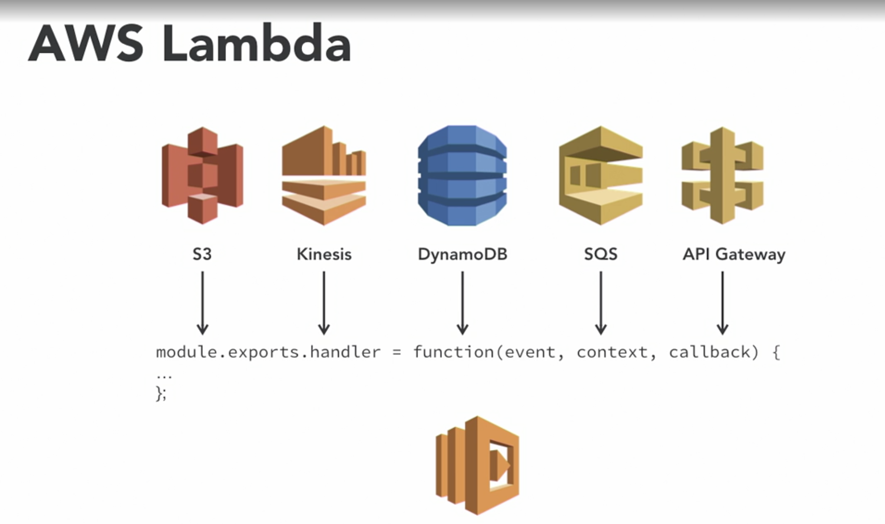

```shell
sls deploy
```

service for create
```json
{
  "name":"marcia",
  "address":"somewhere",
  "productId":"productId11",
  "quantity":"10"
}
```

service for fulfillment
```json
{
  "orderId":"2da50640-357c-11ed-beb7-6f2a7fcdf059",
  "fulfillmentId":"CakeProducer1"
}
```


# kinesis
# aws kinesis
- support realtime data ingestion
[AWS for developers : data driven serverless application with kinesis](https://www.linkedin.com/learning/aws-for-developers-data-driven-serverless-applications-with-kinesis)  
# serverless
- no infrastructure, abstract the infrastructure layer, do not worry about it
- let you scale the application easy
- abstract the environment and server

# Serverless
- BaaS : backend as a service
- FaaS : function as a service

# BaaS: Backend as a service
some service (auth, storage, ...) you can connect using API
samples:
- algolia
- dynamodb
- auth0

# FaaS: Function as a service
  

- the instance is always there, not matter if the code is really needed or not

- if there is just function who needs to be execute, it executes the whole instance no matter what

- if you need to upgrade one function, then you need to deploy the whole function

  

the function keeps idle until the trigger is activate

# FaaS trigger
- http request
- queue message
- database trigger
- ....

# AWS serverless components
lot of components, you don't need to worry about server  
  

# AWS lambda
AWS FaaS platform

languages:
- nodejs
- python
- c#
- java
- go
- lambda layer to implement your own language

# AWS lambda trigger
any of these events could trigger the execution of a lambda function
  


```javascript
module.exports.handler = function(event, context, callback){
    ...
}
```

## AWS lambda event
changes  depends of who invokes the lambda

## AWS lambda context
information of the context, resources and so on

## AWS lambda callback
return information to the one who invoke

# AWS lambda execution model
### 1. sync
the invoker can receive some answer
  

### 2. async
invoke without await for any answer
  

### 3. stream poll
stream service model
  

# Serverless framework 101
- open source CLI
- build and deploy serverless functions
- infrastructure as a code
- provider agnostic (aws, gcp, azure)
- plugins
- multilingual

- application lifecycle
- streaming logs


# infrastructure as a code
- abstract all the infrastructure as a code file
- is the way we configure the infrastructure when we use IaaS
- development speed increases
- one employee can manage big infrastructure 
- repeat the infrastructure easily

# aws CloudFormation
- infrastructure as a a code in aws
- define your infrastructure in a file and then deploy it
  

# aws serverless file : lambda definition
# aws serverless file : resources definition
- the first portion of this file is useful to define the lambda
- the second portion is useful to define all resources needed for the application
  

# serverless deploy
```shell
sls deploy 
```
1. deploy the whole infrastructure
2. then deploy the lambda function
  

# aws lambda basic flow
  

```shell
sls create --template aws-nodejs --name ~name
```

# AWS lambda serverless structure
- handler.js
- serverless.yml

then function is created having in mind the "service" and the "function" name

# kinesis benefits
- real time
- fully managed (don't worry for the infrastructure)
- scalable
- pay as you go

# kinesis types
### data streams
data

### video stream
video

### data firehose
aws data stores

### data analytics

# kinesis flow
1. input from devices
2. data is send to kinesis
3. data is process by spark, ec2, lambda....
4. data is send to some analytics tools
  


# kinesis use cases
- log and events
- real time analytics
- mobile data capture

# kinesis shard
- basic throughput unit of stream
- append only log
- sequence of records (sorted by arrival time)
- ingest 1000 records per second or 1 MB per second
- more shards, more processing capacity

# kinesis data stream
- logical group of shards
- data retention (between 1-7 days)

# kinesis partition key
- identifier
- specified by data producer
- used to split the data into partitions

# kinesis sequence number
- unique identifier assigned by kinesis

# kinesis data record
- (sequence number, partition key, data blob)
- max size is 1MG

# kinesis data producer
- send info to kinesis
- assign partition keys

# kinesis data consumer
- get data from the stream

# lambda application with kinesis
  
- one lambda receives the data and sent to kinesis
- kinesis receives the data
- data is save on dynamo
- kinesis trigger anther lambda to process the data

# why kinesis
- is dynamic
- a database is static
- but kinesis represent event
    - the events represent communication between the applications
        - is not useful for store large data for long time periods, is useful to communicate events
- is faster than http, keep the system decoupled
- great implementation of observable pattern

# kinesis is not a queue, is an stream
- like a queue is useful for event-driven architectures

# aws email simple service
# aws architecture steps
1. 
  

2.
  

3.
  

4.
  

5.
  


# serverless environment variables
```yaml
  functions:
    environment:
      orderTableName: ordersTable
      orderStreamName: ordersStream
```

# AWS lambda permissions
- by default the lambdas does not have any permissions
- therefore you need to set permissions for the needed resources

# serverless plugins
```yaml
plugins:
  - serverless-pseudo-parameters
  - serverless-offline
```

# serverless pseudo parameters
let you get the variables from the environment in an easy way


# lambda gateway event
send http information

# lambda kinesis event
send a list of kinesis data record from a shard to a lambda
- eventID : unique identifier for each message (event) in the stream
- kinesis.data : encoded 64 data
- kinesis.sequenceNumber : unique identifier assigned to the data record
- kinesis.partitionKey : partition for the record

  

# aws SQS - Amazon Simple Queue Service
- fully managed message queuing service
- decouple and scale serverless distributed systems
- send, store, and receive messages between software components at any volume, without losing messages or requiring other services to be available

# aws SQS - limitations
- single consumer
  - once the data is processed by a consumer, the data is deleted
- message replay ability

# aws SNS - amazon Simple Notification Service
- pub/sub messaging service
- notifications, chats, emails, ....
- compare with SQS the receiver is subscriber to the data in a push way
  

# aws kinesis vs SQS vs SNS
- kinesis is a stream
  - real time data
  - ordered data
  - ability to replay the records
  - batch processing support

- SQS is a queue
  - move data between application components
  - messages are processed different

- SNS
  - push notification
    - immediately
  - decouple applications

# application flow
1. http request
2. lambda is executed
3. event is sent to kinesis
4. event is store on dynamo
5. kinesis trigger other lambda
6. lambda read from dynamo the data
7. lambda push a message on the queue
8. other lambda receive that message and process it

# AWS serverless clean environment
- remove streams, tables, endpoints, queues, lambdas
```shell
sls remove
```